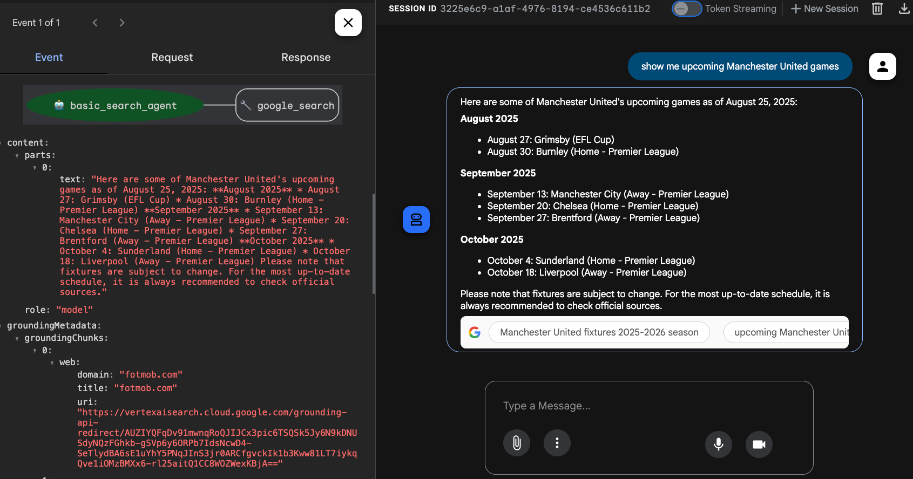
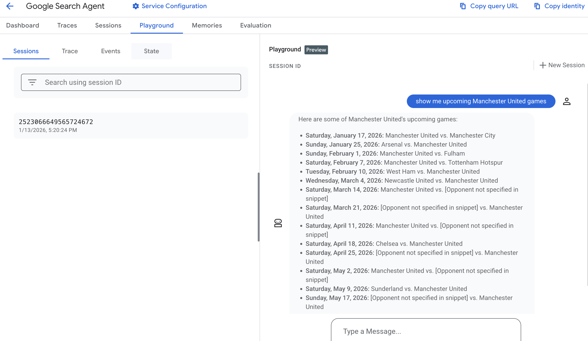
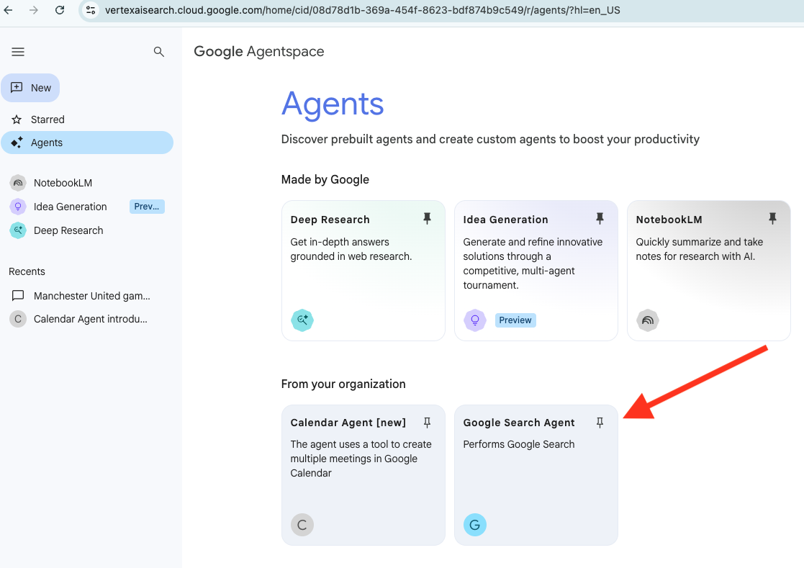
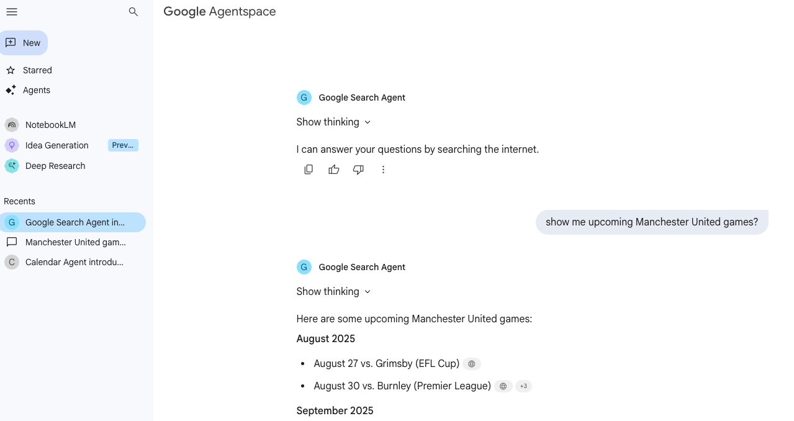
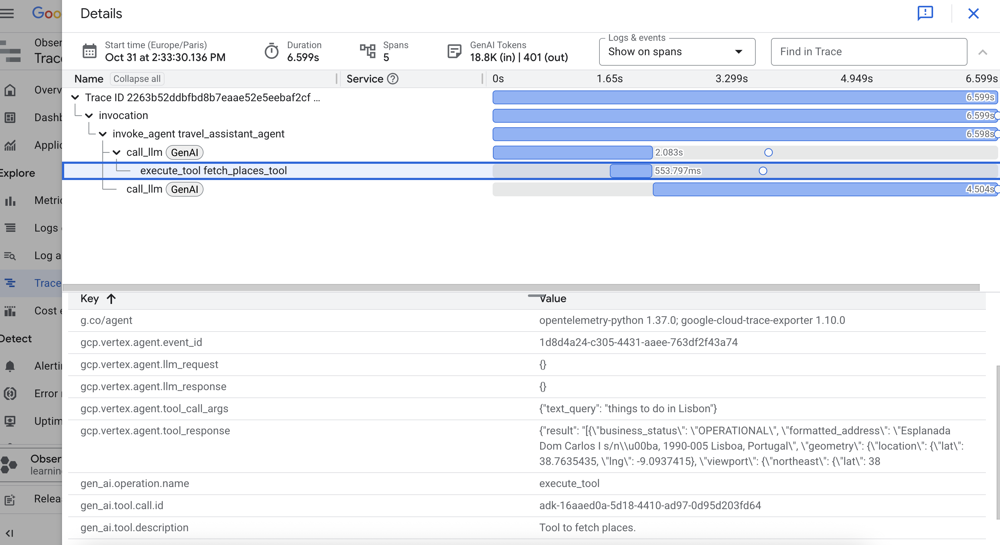

# Gemini Enterprise Hackathons

In this repo, we share some blueprint agents for the hackathon, built with [Google ADK](https://ai.google.dev/gemini-api/docs/adk). We share how to enhance agents with [Agent Starter Pack](https://github.com/GoogleCloudPlatform/agent-starter-pack) and deploy them to [Agent Engine](https://ai.google.dev/gemini-api/docs/agent-engines).

Below is the list of agents and instructions on how to run the basic Google Search agent locally and deploy it to Agent Engine. The rest of the agents are built using the same principles.

Task for today:
 - run Google Search agent locally and deploy it to Agent Engine (followig this Readme);
 - with your team, select one of the agents below and check instructions in the corresponding `agentXX_` folder;
 - optionally, try adapting the agent to your specific needs or use case;
 - do not forget to leave enough time for the final demo!

## Agent "Gallery"

### Google Search

[Simple Google Search Agent](#simple-google-search-agent) – A basic agent that demonstrates how to use the `google_search` tool to answer user queries. Perfect for a quick demo of tool integration.

### Travel Assistant

A travel planner that uses Google Maps tools to route trips and find places of interest.

 - [task\_agent01\_travel\_assistant](agent01_travel_assistant) – contains snippets of code showing how to use Google Maps APIs for routing and finding places of interest;
 - [solution\_agent01\_travel\_assistant](solution_agent01_travel_assistant) provides a solution, see [Readme](solution_agent01_travel_assistant/README.md) there.

 ### Google Trends BigQuery Analyst

An agent that converts natural language to SQL to analyze Google Trends data in BigQuery.

 - [task\_agent02\_google\_trends\_bigquery\_analyst](agent02_google_trends_bigquery_analyst) – contains utils and prompts for the text2sql functionality;
 - [solution\_agent02\_google\_trends\_bigquery\_analyst](solution_agent02_google_trends_bigquery_analyst/) provides a solution, see [Readme](solution_agent02_google_trends_bigquery_analyst//README.md) there;

 ### Media Check Agent

An agent designed to verify media claims using custom Google Search and text analysis utilities.

 - [task\_agent04\_media\_check\_agent](#media-check-agent) – contains snippets implementing custom Google Search and text analysis utils;
 - [solution\_agent04\_media\_check\_agent](solution_agent04_media_check_agent) provides a solution, see [Readme](solution_agent04_media_check_agent/README.md) there.

### GitHub Agent (MCP)

*Note: this agent needs ADK version 1.18.0 to run*

An agent that connects directly to the official GitHub MCP server to search repositories and issues.

 - [task\_agent03\_github\_mcp\_agent](agent03_github_mcp_agent) – contains instructions and code snippets;
 - [solution\_agent03\_github\_mcp\_agent](solution_agent03_github_mcp_agent) provides a solution.

### GitHub Agent (A2A + Custom MCP Server)

*Note: this agent needs ADK version 1.18.0 to run*

A distributed multi-agent system where a client agent delegates tasks to a GitHub service agent using the Agent-2-Agent protocol.

 - [task\_agent08\_github\_a2a\_agent\_mcp\_server](agent08_github_a2a_agent_mcp_server) – contains high-level instructions and code snippets;
 - [solution\_agent08\_github\_a2a\_agent\_mcp\_server](solution_agent08_github_a2a_agent_mcp_server) provides a solution, see [Readme](solution_agent08_github_a2a_agent_mcp_server/README.md) there.

### YouTube Highlights Agent

An agent that summarizes YouTube videos and extracts key highlights.

- [task\_agent05\_youtube\_highlights\_agent](agent05_youtube_highlights_agent) – agent skeleton;
- [solution\_agent05\_youtube\_highlights\_agent](solution_agent05_youtube_highlights_agent) – solution.

### Research Assistant Agent

A sophisticated research agent that mimics a human workflow: planning, researching, writing, reflecting, and revising to produce high-quality essays.

- [task\_agent07\_research\_assistant](agent07_research_assistant) – agent skeleton with subagents for planning, researching, writing, and reflecting;
- [solution\_agent07\_research\_assistant](solution_agent07_research_assistant) – complete solution implementing the research loop.

### Mova: GenMedia Agent (Nano + Veo)

A multimodal agent that uses Gemini Nano and Veo to generate creative media content.

- [task\_agent09\_mova\_nano\_veo\_agent](agent09_mova_nano_veo_agent) - agent skeleton;
- [solution\_agent09\_mova\_nano\_veo\_agent](solution_agent09_mova_nano_veo_agent) – solution.

The rest of the document explains how to deploy an agent (taking google search as an example) to Agent Engine and link it to Gemini Enterprise.

## Prereq

- install `uv`: `pip install uv`
- run `uv sync`

## Local test

 - `cp .env.example .env`
 - specify Google Cloud Project ID in [.env](.env)
 - authenticate to your Google Cloud project:

    ```bash
    PROJECT_ID=hackathon-3-486911

    gcloud config set project $PROJECT_ID
    gcloud auth application-default login
    gcloud auth application-default set-quota-project $PROJECT_ID
    ```

 - run `uv run adk web`
 - open [http://127.0.0.1:8000](http://127.0.0.1:8000 )
 - select the agent in the drop-down menu
 - put in any Google search query, e.g. "show me upcoming Manchester United games?"





## Enhancing the agent with Agent Starter Pack

To bring in Agent Engine and Gemini Enterprise deployment utils (and if needed CI/CD, Terrafrom integration for further productionalization), we are using the [Agent Starter Pack](https://github.com/GoogleCloudPlatform/agent-starter-pack).

```bash
uvx agent-starter-pack enhance
```

```
=== Google Cloud Agent Starter Pack 🚀===
Enhancing your existing project with production-ready agent capabilities!

Using current directory name as project name: adk-hackathon-bundle

🚀 Ready to enhance your project with deployment capabilities
📂 /home/admin_/adk-hackathon-bundle

What will happen:
• New template files will be added to this directory
• Your existing files will be preserved
• A backup will be created before any changes

```

Select `adk_base` as a template (press 1 for that).

Then select the folder containing code for the agent, e.g. `google_search_agent`.

The agent directory needs to contain:

  • `agent.py` file with your agent logic
  • `root_agent` variable defined in agent.py

The rest of the options can be set to defaults.

The agent starter pack is going to enhance the code base with deployment utils, tests, notebooks etc. This is an example for the  `google_search_agent`:

```
adk-hackathon-bundle/
├── google_search_agent/                 # Core application code
│   ├── agent.py         # Main agent logic
│   ├── agent_engine_app.py # Agent Engine application logic
│   └── app_utils/           # Utility functions and helpers
├── Makefile             # Makefile for common commands
├── GEMINI.md            # AI-assisted development guide
└── pyproject.toml       # Project dependencies and configuration
```

See generated `starter_pack_README.md` for more details.

Once finished, perform as prompted:

```bash
cd . && make install && make playground
```

This will open ADK web at [localhost:8051](localhost:8051). Make sure that the agent works as intended

## Deploying the agent with Agent Starter Pack

```bash
make backend
```

Look into the `Makefile` if you want to customize the deployment e.g. by adding an agent name.

This is going to take some 7 min. You’ll see output similar to this

```
🚀 Creating new agent: Google Search Agent
🚀 Deploying to Vertex AI Agent Engine (this can take 3-5 minutes)...
INFO:vertexai_genai.agentengines:Creating in-memory tarfile of source_packages
INFO:vertexai_genai.agentengines:Using agent framework: google-adk
INFO:vertexai_genai.agentengines:View progress and logs at https://console.cloud.google.com/logs/query?project=learning-agentspace&query=resource.type%3D%22aiplatform.googleapis.com%2FReasoningEngine%22%0Aresource.labels.reasoning_engine_id%3D%221138510205701586944%22.
INFO:vertexai_genai.agentengines:Agent Engine created. To use it in another session:
INFO:vertexai_genai.agentengines:agent_engine=client.agent_engines.get(name='projects/903290458825/locations/us-central1/reasoningEngines/1138510205701586944')
INFO:root:Agent Engine ID written to deployment_metadata.json

✅ Deployment successful!
Service Account: service-903290458825@gcp-sa-aiplatform-re.iam.gserviceaccount.com

📊 Open Console Playground: https://console.cloud.google.com/vertex-ai/agents/locations/us-central1/agent-engines/1138510205701586944/playground?project=YOUR_GCP_PROJECT_ID
```

Now you can see your agent in Agent Engine, where you can also find Playground to test the agent.



## Register the agent to [Gemini Enterprise](https://googlecloudplatform.github.io/agent-starter-pack/cli/register_gemini_enterprise.html)

1. Manually create the Gemini Enterprise app in the Google Cloud Console, if not yet done

2. Run:

```bash
make register-gemini-enterprise
```

And select the Gemini Enterprise app name (in the example below the app name is `gemini-enterprise-test-app`)


Sample output:

```
Registering agent to Gemini Enterprise...
  Agent Engine: projects/903290458825/locations/us-central1/reasoningEngines/1138510205701586944
  Gemini Enterprise App: projects/903290458825/locations/global/collections/default_collection/engines/gemini-enterprise-test-app
  Display Name: Google Search Agent

✅ Successfully registered agent to Gemini Enterprise!
   Agent Name:
   projects/903290458825/locations/global/collections/default_collection/engines/gemini-enterprise-test-app/assistants/default_assistant/agents/12666830553819447413

🔗 View in Console:
   https://console.cloud.google.com/gemini-enterprise/locations/global/engines/gemini-enterprise-test-app/overview/dashboard?project=learning-agentspace
```

Now you can test your awesome agent in Gemini Enterprise. Go to "Gemini Enterprise" in Google Cloud console, select the app, click the web app link in  “Overview” and you’ll see the Gemini Enterprise interface. The "Agents" tab will look like this:





## Tracing the agent

Agent Engine support Cloud tracing and OpenTelemetry for your deployed agent. Go to "Trace explorer" in the Google Cloud console. Here you can see the traces from agent invocation, e.g.the below one for the Travel Assistant. Here we can check latency for each step, make sure that tools are invoked when needed, see the params of tool calls etc.


