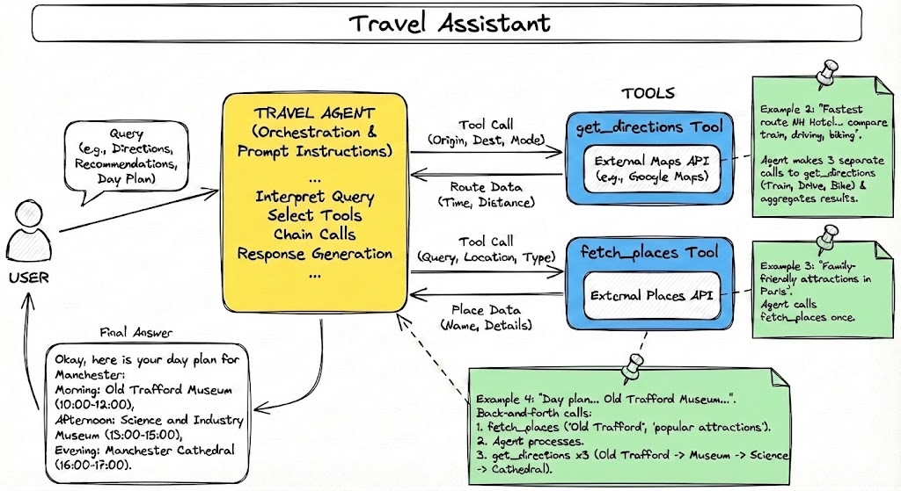

# Travel assistant

This travel assistant provides clear, tailored instructions for getting to the accommodation, creates lists of things to do based on user preferences, and generates detailed, feasible day-trip plans.



## Agent Specification
This agent acts as your personal travel concierge. It is designed to help you plan your trip by providing tailored recommendations and detailed itineraries. The agent leverages Google Maps and Search to offer comprehensive and relevant travel information.

1. Get to Your Accommodation

The agent provides clear and customized instructions to get from your arrival airport to your accommodation, considering your specific needs and real-time conditions.
 - Get route options: "How do I get from Schiphol Airport to the NH Hotel in The Hague?"
 - Consider a travel party: "What's the best way to get to the hotel with two young children?"
 - Factor in real-time conditions: "What is the fastest route to my hotel right now, considering traffic?"

This agent uses Google Maps Direction API for grounding.

2. Discover Things to Do
The agent creates a curated list of places and activities based on your interests and the city you are visiting.
 - Find attractions: "What are some good family-friendly attractions in Paris?"
 - Get recommendations based on preferences: "Can you suggest some parks and playgrounds in Paris for young children?"
 - Provide a list of places: "Give me a list of museums to visit in Manchester."

This agent uses Google Maps Places API for grounding.

3. Plan Your Day

The agent generates a detailed and feasible day trip plan, including a timeline, travel times, and explanations for each recommended activity.
 - Create a full-day itinerary: "Plan a full day in Paris for my family."
 - Incorporate specific preferences: "Create a day plan for me in Manchester that includes the Old Trafford Museum."
 - Include travel and breaks: "Make a day plan for Madrid with walking directions and include a break for lunch."

This agent uses Google Maps Direction and Places APIs for grounding.
Note that the same is not yet possible to achieve directly in gemini.google.com, here we are instructing the agent to use Google Maps tooling in a specific way to build a day plan.

## Prereqs

 - enable Google Maps Places API in Directions API
 - create a Google Maps API key
 - `cp travel_assistant/.env.example travel_assistant/.env`
 - put the API key into `travel_assistant/.env`


Sample scripts:

```python
uv run python travel_assistant/fetch_places_with_text_query.py
```
returns top-7 results for a query "*good places for French cuisine in Paris close to the Google office, 25 Av. de Clichy*"

```python
uv run python travel_assistant/get_directions_between_two_places.py
```

provides instructions on how to reach one destination from another.

## Task

High-level instructions:
 - Use the tools above to come up with an agent, you can use the specification above for agent instruction
 - Test the agent locally (`uv run adk run agent01_travel_assistant` or `uv run adk web`)
 - Deploy the agent to Agent Engine
 - Test the deployed version of the agent
 - Link the agent to a Gemini Enterprise application
 - Make sure it works in Gemini Enterprise as well
