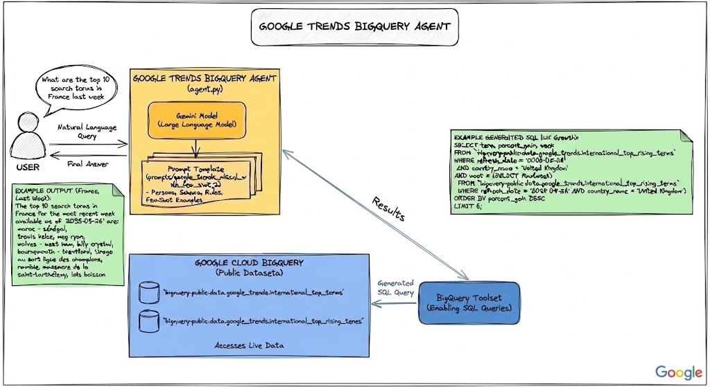
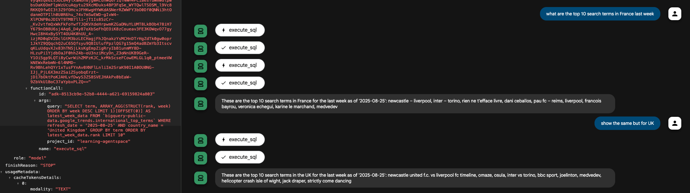

# BigQuery Google Trends Analyst

This agent is a BigQuery SQL expert designed to answer natural language questions about top trending and rising international search terms from Google Trends. It leverages the power of a large language model to understand user questions and translates them into efficient BigQuery SQL queries.



Example query: _What are the top 10 search terms in Germany for the most recent week available?_

Generated SQL:

```sql
SELECT   term,
         -- Use ARRAY_AGG to get the rank and week for the most recent week's data
         array_agg(Struct(rank, week) order BY week DESC limit 1) AS latest_week_data
FROM     `bigquery-PUBLIC-data.google_trends.international_top_terms`
WHERE
         -- Rule 1: Mandatory filter on the exact refresh_date provided
         refresh_date = '{{ refresh_date_value }}'
AND      country_name = 'Germany'
GROUP BY term
ORDER BY
         -- The rank is inside the struct, so we must unnest it to sort
         (
                SELECT rank
                FROM   unnest(latest_week_data)) limit 10;
```

Agent’s response: _These are the top 10 search terms in Germany for the most recent week available as of '2025-08-25': hamburg brand, helene fischer, newcastle - liverpool, habeck, queen, verónica echegui, höhle der löwen, yanni gentsch, verschwunden auf sardinien, sara kulka_

## Prereqs

 - `cp google_trends_bigquery_analyst/.env.example google_trends_bigquery_analyst/.env`
 - modify the `.env` file

Here's a breakdown of the key components:

 - **[to be implemented]** [agent.py](agent.py): ADK agent that uses `BigQueryToolset` ([docs](https://google.github.io/adk-docs/tools/built-in-tools/#bigquery)) to convert natural Language queries to SQL, execute SQL queries and provide a response.

 - [utils.py](utils.py): This module contains helper functions to get the latest table refresh date and load the prompt

 - [prompts/google_trends_nl2sql_with_few_shot.j2](prompts/google_trends_nl2sql_with_few_shot.j2): This is the heart of the agent. It is a Jinja2 template that serves as a comprehensive set of instructions for the agent. The template includes persona, table schemas, rules and few-shot examples.

Here are a couple of examples when running with `uv run adk web`:



Football seems to be the dominating topic in UK and France.


## High-level instructions

 - Explore starter code in this folder
 - Explore the [BigQueryToolset](https://google.github.io/adk-docs/tools/built-in-tools/#bigquery) from the ADK built-in toolset
 - Implement the agent in `agent02_google_trends_bigquery_analyst/agent.py`
 - Test the agent locally (`uv run adk run agent02_google_trends_bigquery_analyst` or `uv run adk web`)
 - Deploy the agent to Agent Engine
 - Test the deployed version of the agent
 - Link the agent to a Gemini Enterprise application
 - Make sure it works in Gemini Enterprise as well
