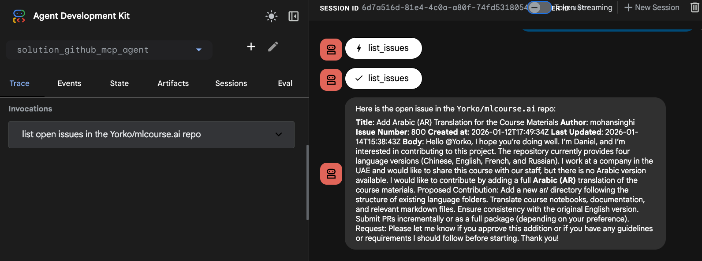

# 🐙 GitHub Agent (ADK + MCP)

This project demonstrates how to build a Google ADK (Agent Development Kit) agent that interacts directly with the GitHub API using the **MCP (Model Context Protocol)**.

Unlike the A2A version, this agent connects **directly** to the GitHub MCP server, making it simpler and self-contained.

---

## 🔧 Architecture Overview

*   **Single Agent**: The agent runs locally and acts as an MCP Client.
*   **MCP Connection**: It connects to the official GitHub MCP endpoint (`https://api.githubcopilot.com/mcp/`) using a Personal Access Token.
*   **Capabilities**: It loads tools like `search_repositories`, `search_issues`, and `list_issues` directly into the agent's context.

## 💡 Implementation Hints

When configuring the `MCPToolset`, you should use `StreamableHTTPConnectionParams` to connect to the GitHub MCP server.

*   **Endpoint**: `https://api.githubcopilot.com/mcp/`
*   **Class**: `google.adk.tools.mcp_tool.StreamableHTTPConnectionParams`
*   **Documentation**: [MCP Tools Prerequisites](https://google.github.io/adk-docs/tools-custom/mcp-tools/#prerequisites)

Example snippet:

```python
from google.adk.tools.mcp_tool import MCPToolset, StreamableHTTPConnectionParams

mcp_tools = MCPToolset(
    connection_params=StreamableHTTPConnectionParams(
        url="https://api.githubcopilot.com/mcp/",
        headers={...}
    ),
    ...
)
```

---

## ⚙️ Setup and Configuration

### 1. Prerequisites

*   Python **3.10+**
*   **Important:** This agent requires `google-adk[a2a]>=1.18.0` (for MCP support).
*   Create a GitHub token `GITHUB_PERSONAL_ACCESS_TOKEN` [here](https://github.com/settings/tokens).
    *   It helps to have a fine-grained token with access to the repositories you want to search.

### 2. Environment Variables

Create a `.env` file in the root of the project directory.

```env
# .env file

# Your GitHub Access Token
GITHUB_PERSONAL_ACCESS_TOKEN="YOUR_GITHUB_ACCESS_TOKEN_HERE"

# The generative model to use for the agents
MODEL_NAME="gemini-2.5-flash"

# The GCP project.
GOOGLE_CLOUD_PROJECT="YOUR_GCP_PROJECT"
GOOGLE_CLOUD_LOCATION="us-central1"
GOOGLE_GENAI_USE_VERTEXAI="True"
```

---

## 🚀 Running the Application

You can run this agent using the ADK web interface.

### Step 0: Install dependencies

```bash
uv sync
```

### Step 1: Run the Web Client

Launch the web client from the **project root**:

```bash
uv run adk web
```

(Note: Ensure your `pyproject.toml` in `agent03_github_mcp_agent/` is correctly set up with `google-adk[a2a]` dependency).

---

Open the displayed URL (usually `http://localhost:8000`) in your web browser.
You can now ask the agent questions like:
- "Find open issues in the google-adk-python repository"
- "Search for repositories related to 'agentic workflow'"



## High-level instructions

 - Use the tools above to come up with an agent, you can use the specification above for agent instruction
 - Test the agent locally (`uv run adk web`)
 - Deploy the agent to Agent Engine
 - Test the deployed version of the agent
 - Link the agent to a Gemini Enterprise application
 - Make sure it works in Gemini Enterprise as well
