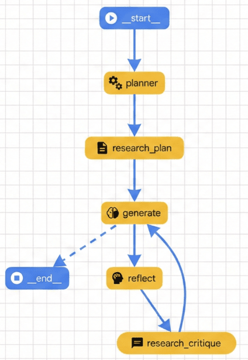

# Research Assistant Agent

## Overview

In this task, you will build a sophisticated **Research Assistant Agent** using Google ADK. This agent mimics a human research workflow: planning, researching, writing, reflecting (critiquing), and revising.

## Why is this needed?

Basic LLM prompts often fail to produce high-quality, deeply researched content in a single pass. By breaking the process into specialized sub-agents and a feedback loop, we can achieve significantly better results. This pattern is common in advanced agentic workflows (e.g., LangGraph "Essay Writer").

## Designing the agent



The architecture follows a structured flow:
1.  **Start**: The process begins.
2.  **Planner**: Generates a high-level outline.
3.  **Research Plan**: Creates search queries and gathers initial information.
4.  **Generate** (Writer): Drafts the essay based on the plan and research.
5.  **Reflect** (Critic): Critiques the draft and provides feedback.
6.  **Research Critique**: Gathers additional info to address the critique.
7.  **Loop**: The flow cycles back to **Generate** to improve the draft until ready.
8.  **End**: Returns the final essay.

## Goal

Implement the missing sub-agents and orchestration logic in `agent07_research_assistant/`.

## Instructions

1.  **Planner ([`subagents/planner.py`](agent07_research_assistant/subagents/planner.py))**: Implement an `LlmAgent` that generates an outline.
2.  **Researchers ([`subagents/researchers.py`](agent07_research_assistant/subagents/researchers.py))**: Implement `researcher` (initial) and `critique_researcher` (follow-up) agents using the `google_search` tool.
3.  **Reflector ([`subagents/reflector.py`](agent07_research_assistant/subagents/reflector.py))**: Implement an `LlmAgent` that acts as a critic/teacher.
4.  **Workflow ([`subagents/workflow.py`](agent07_research_assistant/subagents/workflow.py))**: Implement `ResearchAppender` (to store research) and `RevisionController` (to manage the loop).
5.  **Orchestraion ([`agent.py`](agent07_research_assistant/agent.py))**: Combine everything into a `root_agent` using `SequentialAgent` and `LoopAgent`.

## Verification

Run the test script to verify your implementation:
```bash
uv run agent07_research_assistant/test_research_agent.py
```

## High-level instructions

 - Looking at the agent specification above and the provided code snippets, implement an ADK agent
 - Test the agent locally (`uv run agent07_research_assistant/test_research_agent.py` or `uv run adk web`)
 - Deploy the agent to Agent Engine
 - Test the deployed version of the agent
 - Link the agent to a Gemini Enterprise application
 - Make sure it works in Gemini Enterprise as well
